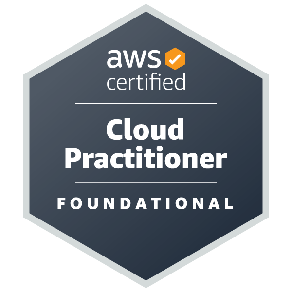
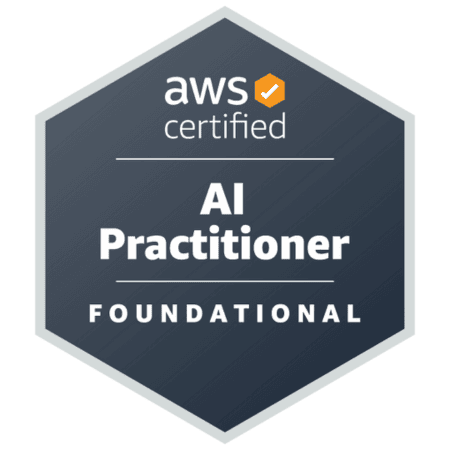

Hi 👋   
I'm Michał, a web and game developer 

📫 How to reach me: 
  - you can send an email to [mterczynski1@gmail.com](mailto:mterczynski1@gmail.com)
  - or you can reach me out on [LinkedIn](https://www.linkedin.com/in/mterczynski/)  
  
📱 Website with my projects: [www.mter.pl](http://www.mter.pl)

Certificates I've acquired:

  
  
  

<!--  -->

